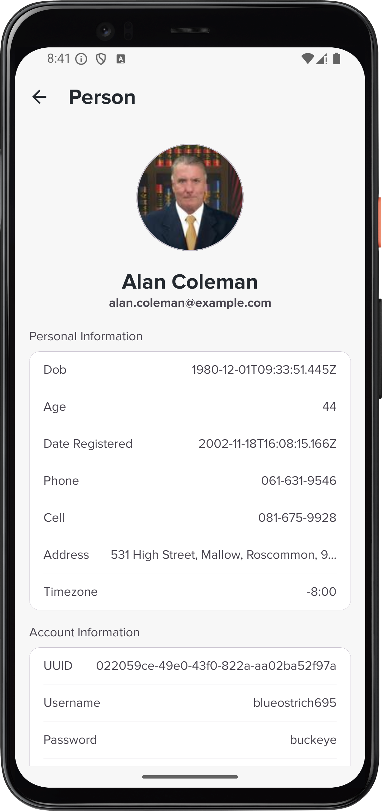
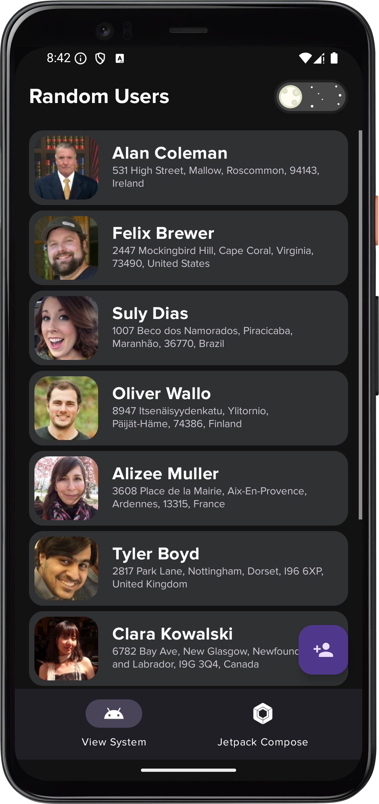

<h1 align="center">Random Users</h1>

## Features
- [x] View detailed information about users.
- [x] Pagination support for loading more data.
- [x] Offline caching of user data.
- [x] Dark mode support.
- [x] Compose Version.
- [ ] Unit test.

## Previews
### Conventional XML
### Light Mode ☀️
|  |  |  | 
|-------------------------------------------------------------------------------------|-------------------------------------------------------------------------------------|-------------------------------------------------------------------------------------|
| <p align="center">XML Layout</p>                                                    | <p align="center">Input Random Generator</p>                                        | <p align="center">User Details</p>                                                  |

### Dark Mode 🌑
|  |  | 
|-------------------------------------------------------------------------------------|-------------------------------------------------------------------------------------|
| <p align="center">XML Layout</p>                                                    | <p align="center">User Details</p>                                        |

### Jetpack Compose
### Light Mode ☀️
|  |  | 
|-------------------------------------------------------------------------------------|-------------------------------------------------------------------------------------|
| <p align="center">XML Layout</p>                                                    | <p align="center">User Details</p>                                                  |

### Dark Mode 🌑
|  |  | 
|-------------------------------------------------------------------------------------|-------------------------------------------------------------------------------------|
| <p align="center">XML Layout</p>                                                    | <p align="center">User Details</p>                                        |

## Technologies and Frameworks
- **Dagger Hilt**: Dependency injection library for Android.
- **Room**: A library for working with SQLite databases, making data persistence easier and type-safe.
- **Retrofit**: Type-safe HTTP client for Android and Java.
- **OkHttp**: A powerful HTTP client used for making efficient network requests and managing connections.
- **Navigation Component**: A tool to simplify app navigation, handling transitions between screens and deep links.
- **Paging3**:  A library that loads large datasets efficiently in a paginated way, improving performance.
- **Coil**: A lightweight image loading library.
- **Kotlin**: Programming language used for Android development.
- **Coroutines**: Concurrency design pattern that you can use on Android to simplify code that executes asynchronously.
- **Flow**: A cold asynchronous data stream that sequentially emits values and completes normally or with an exception.
- **Compose**: Android’s modern toolkit for building native UI.
- **Moshi**: A fast, efficient library for parsing and converting JSON into Kotlin objects.
- **XML**: Conventional XML layouts for UI components.

## Note
The project using [spotless](https://github.com/diffplug/spotless/tree/main/plugin-gradle) with [klint](https://github.com/pinterest/ktlint).
Run these commands to verify and apply the formatting rules before building or running the project.

```bash
./gradlew spotlessCheck
./gradlew spotlessApply
```

## License
```text
Copyright 2024 strongforce1

Licensed under the Apache License, Version 2.0 (the "License");
you may not use this file except in compliance with the License.
You may obtain a copy of the License at

    http://www.apache.org/licenses/LICENSE-2.0

Unless required by applicable law or agreed to in writing, software
distributed under the License is distributed on an "AS IS" BASIS,
WITHOUT WARRANTIES OR CONDITIONS OF ANY KIND, either express or implied.
See the License for the specific language governing permissions and
limitations under the License.
```

